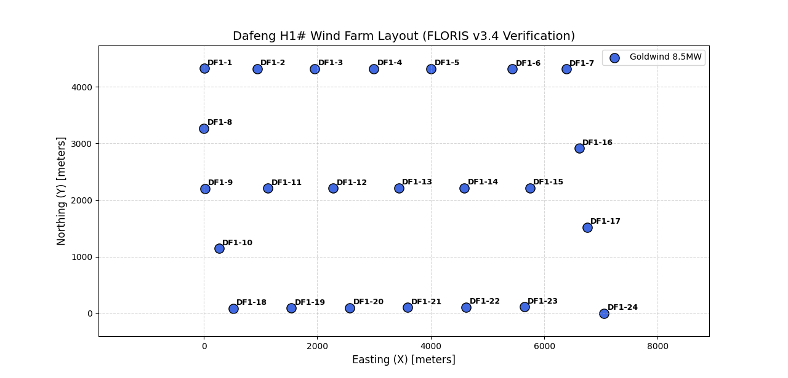

# WFCRL: Interfacing and Benchmark Reinforcement Learning for Wind Farm Control

## Environments

List all environments with:

```
from wfcrl import environments as envs
envs.list_envs()
```

All wind farms environments are implemented with both the `Gymnasium` and `PettingZoo` API, and can be run on both the `Floris` and the `FAST.Farm` wind farm simulators.

The root name of the environment is associated with a specific layout, of arrangement of turbines in the field. It is combined with a prefix and a suffix:
- A `Dec_` prefix is added before environment names to indicate an Agent Environment Cycle implementation supported by `PettingZoo`.
- A `Floris` or `FAST.Farm` suffix is added after the name of the environment to indicate the name of the background simulator.


| Root Name          | **\# Agents** | **Description**     |
|----------------------------------|--------------------|--------------------------------------------------------------------------------------|
| DafengH1                         | 24                 | Layout of the DafengH1 wind farm (24 x Goldwind 8.5MW turbines, China)               |
| Ablaincourt                      | 7                  | Inspired by layout of the Ablaincourt farm    (Duc et al, 2019)            |
| Turb16_TCRWP                    | 16                 | Layout of the [Total Control Reference Wind Power Plant](https://farmconners.readthedocs.io/en/latest/provided_data_sets.html) (TC RWP) (the first 16 turbines)   |
| Turb6_Row2                      | 6                  | Custom case  - 2 rows of 3 turbines                                  |
| Turb16_Row5                     | 16                 | Layout of the first 32 turbines in the the CL-Windcon project [as implemented in WFSim](https://github.com/TUDelft-DataDrivenControl/WFSim/blob/master/layoutDefinitions/layoutSet_clwindcon_80turb.m)           |
| Turb32_Row5                     | 32                 | Layout of the farm used in the                            |
| TurbX_Row1 for X in [1, 12] | X                  | Procedurally generated single row layout with X turbines, |
| Ormonde                          | 31                 | Layout of the Ormonde Offshore Wind Farm                                             |
| WMR                              | 36                 | Layout of the Westermost Rough Offshore Wind Farm                                    |
| HornsRev1                        | 76                 | Layout of the Horns Rev 1 Offshore Wind Farm                                         |
| HornsRev2                        | 92                 | Layout of the Horns Rev 2 Offshore Wind Farm                                         |

A visual overview of some layouts:

| Turb7_Row1      | Ormonde | HornsRev2     | DafengH1|
|----------------------------------|--------------------|--------------------|--------------------------------------------------------------------------------------|
|   |    |    |   |


## Example

Creating a wind farm environment of the Ablaincourt layout with the Floris background on Gymnasium:

```
from wfcrl import environments as envs
env = envs.make("Ablaincourt_Floris")
```
```
Examples of test cases are given in the `examples` folder:

| Script | Description |
|--------|-------------|
| `python examples/example_floris.py` | Simulate `Ablaincourt` layout on FLORIS |
| `python examples/example_fastfarm.py` | Simulate any FAST.Farm case with the standalone interface |
| `python examples/run_dafeng_baseline.py` | DafengH1 baseline simulation on FAST.Farm (24 turbines, standalone) |
| `python examples/example_hycon_farm_control.py` | HyCon/ROSCO-style segmented farm control with FAST.Farm |
| `python examples/example_online_control.py` | Online closed-loop optimization control with FAST.Farm |

> **Note:** The new standalone example scripts use `FastFarmStandaloneInterface` / `FastFarmOnlineInterface` (subprocess-based) and do **not** require MPI. The legacy MPI-based `FastFarmInterface` remains available for backward compatibility.

More detailed examples can be found in the `demo.ipynb` notebook. See below under *Running Example Notebooks*.

## Installation

In the virtual environment of your choice:

```
pip install -e .
```

### FAST.Farm Simulator (Windows)

WFCRL supports **FAST.Farm v5.0.0** (upgraded from v3.5.1).

1. **Download FAST.Farm v5.0.0** from the [OpenFAST v5.0.0 release page](https://github.com/OpenFAST/openfast/releases/tag/v5.0.0):
   - `FAST.Farm_x64_OMP.exe` (or `FAST.Farm_x64.exe` for non-OpenMP)
   - Place the executable in `wfcrl/simulators/fastfarm/bin/FAST.Farm_x64_OMP.exe`

2. **Download DISCON v5.0.0 DLL** from the [same release page](https://github.com/OpenFAST/openfast/releases/tag/v5.0.0):
   - `DISCON.dll` — NREL 5MW reference controller, pre-compiled for OpenFAST v5.0.0
   - Place it in `wfcrl/simulators/fastfarm/servo_dll/DISCON_WT1.dll`

3. **Install MS-MPI** (required only for the legacy MPI-based interface):
   Download **BOTH** Windows MPI setup (.exe) and MPI SDK (.msi) from [Microsoft MPI](https://www.microsoft.com/en-us/download/details.aspx?id=100593)

   Verify your installation by running `set MSMPI` in a command prompt:

   ```
   MSMPI_BENCHMARKS=C:\Program Files\Microsoft MPI\Benchmarks\
   MSMPI_BIN=C:\Program Files\Microsoft MPI\Bin\
   MSMPI_INC=C:\Program Files (x86)\Microsoft SDKs\MPI\Include\
   MSMPI_LIB32=C:\Program Files (x86)\Microsoft SDKs\MPI\Lib\x86\
   MSMPI_LIB64=C:\Program Files (x86)\Microsoft SDKs\MPI\Lib\x64\
   ```

4. **Test the setup** (standalone, no MPI needed):

   ```
   python examples/example_fastfarm.py --case DafengH1 --steps 3
   ```

   Or run the full DafengH1 baseline:

   ```
   python examples/run_dafeng_baseline.py
   ```

## Interfacing with FAST.Farm

WFCRL provides three interface levels for FAST.Farm. The **standalone interface** (subprocess-based) is the recommended approach for most use cases.

A tutorial is also available in the `interface.ipynb` notebook (see *Running Example Notebooks*).

### 1. Standalone Interface (`FastFarmStandaloneInterface`)

The preferred way to run FAST.Farm. Uses `subprocess` (no MPI) — launches FAST.Farm, runs the full simulation, and parses `.outb` output files.

**Basic usage:**

```python
from wfcrl.environments.data_cases import named_cases_dictionary
from wfcrl.interface import FastFarmStandaloneInterface

farm_case = named_cases_dictionary["DafengH1_"][0]
config = farm_case.dict()
config["max_iter"] = 10
config["speed"] = 10.0

ff = FastFarmStandaloneInterface(config, output_dir="./my_sim")
ff.setup()                          # Generate input files
ff.set_yaw_pitch(yaw_deg=270.0, pitch_deg=0.0)  # Set fixed yaw/pitch
measurements = ff.run()             # Run FAST.Farm and parse outputs

# measurements contains:
#   'time'     - time vector
#   'power_mw' - per-turbine power (n_steps x n_turbines)
```

**On Windows**, by default, the FAST.Farm executable is expected at:
`wfcrl/simulators/fastfarm/bin/FAST.Farm_x64_OMP.exe`.

### 2. Online / Step-by-Step Interface (`FastFarmOnlineInterface`)

For **closed-loop optimization** — runs one `DT_low` time step at a time, so the controller can react to measurements before the next step.

```python
from wfcrl.interface import FastFarmOnlineInterface

interface = FastFarmOnlineInterface(config, output_dir)
interface.setup()

for step in range(n_steps):
    meas = interface.step(yaw_deg, pitch_deg)
    # meas['power_mw']       -> per-turbine power (MW)
    # meas['farm_power_mw']  -> total farm power (MW)
    # meas['yaw_cmd']        -> applied yaw
    # meas['pitch_cmd']      -> applied pitch
    yaw_next, pitch_next = my_controller.optimize(meas)
```

### 3. Controller Base Class (`FarmControllerBase`)

A base class for implementing farm-level controllers in the HyCon/ROSCO style:

```python
from wfcrl.interface import FarmControllerBase

class MyController(FarmControllerBase):
    def compute_controls(self, measurement_dict):
        # measurement_dict contains 'power_mw', 'farm_power_mw', 'time', etc.
        return {'yaw': ..., 'pitch': ...}

controller = MyController(n_turbines)
controls = controller.step(measurement_dict)
```

### 4. Legacy MPI Interface (`FastFarmInterface`)

The original MPI-based interface is still available for backward compatibility. It uses `mpi4py` to spawn FAST.Farm as an MPI process.

```python
from wfcrl.interface import FastFarmInterface

interface = FastFarmInterface.from_case(case, fast_farm_executable=path_to_exe)
interface.init(wind_speed=10.0)
interface.update_command(yaw=np.zeros(num_turbines))
```

> **Note:** The legacy MPI interface requires MS-MPI and `mpi4py`. For new projects, prefer `FastFarmStandaloneInterface`.

### Measurements

At every iteration, all interfaces retrieve per-turbine measurements:
- Wind speed and direction at the farm entrance
- Turbine output power
- Yaw, pitch, and torque
- 6 blade load components (root bending moments)

A detailed tutorial is available in the `interface.ipynb` notebook (see *Running Example Notebooks*).


# Running Example Notebooks

On Windows, to run the `interface.ipynb` and `demo.ipynb` examples, you will first need to install the WFCRL kernel:

- Install `jupyter notebook` and `seaborn`:

```
pip install notebook seaborn
```

- Install the jupyter kernel

```
from wfcrl import jupyter_utils
jupyter_utils.create_ipykernel()
```
