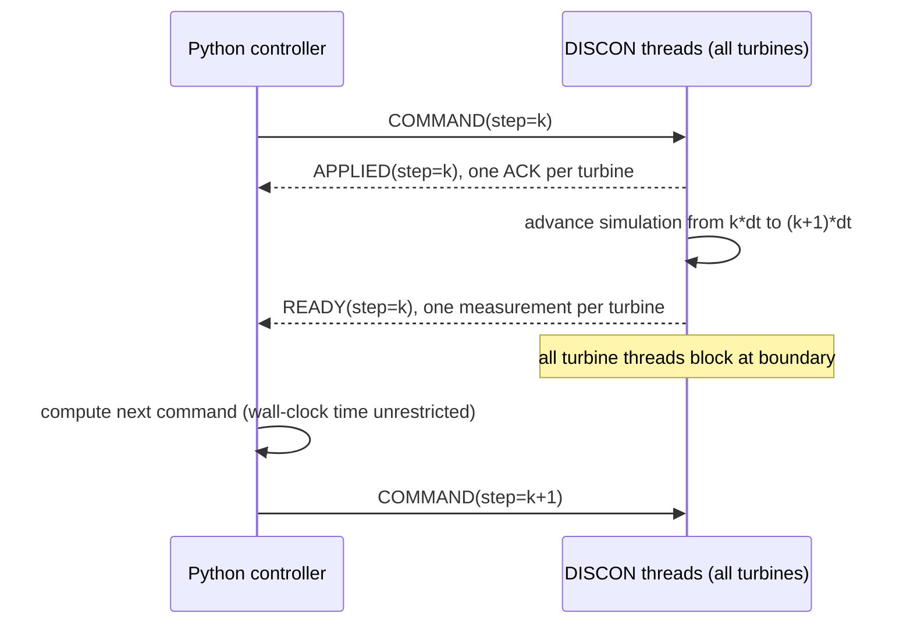

# 连续 FAST.Farm 严格握手协议 v1

## 解决的问题

旧版连续接口中，FAST.Farm 按仿真时间持续运行，Python 控制器按墙钟时间计算。
控制器耗时一旦超过控制周期 `dt`，求解器会继续使用旧命令推进，最终造成命令、
测量值和 `step` 编号错位。

协议 v2 在每个控制周期边界建立全风机场屏障。FAST.Farm 的每个风机控制线程写出
周期末测量后等待，只有收到严格连续的下一步命令才继续计算。因此控制器计算可以
慢于 `dt`，但不会丢失仿真步。

严格模式必须使用显示 `OpenMP: Yes` 的 FAST.Farm 可执行文件。串行版本在 T1 阻塞
后无法调用 T2，会形成确定性死锁；接口会在启动前探测版本横幅并拒绝串行程序。

## 状态机



Python 只有同时收到所有风机的 `APPLIED` 或 `READY` 才能越过相应屏障。任何未来
步号都会被视为数据丢失并立即报错，而不是使用 `>= step` 静默接受。

## 文件格式

控制文件由 Python 在同一目录写临时文件后原子替换：

```text
step=3 protocol=2 sync=strict dt=2 timeout=120
T1 mode=0 yaw=270.000 pitch=0.000 power=0.000 minpitch=0.000
T2 mode=0 yaw=270.000 pitch=0.000 power=0.000 minpitch=0.000
END
```

每台风机应用命令后写：

```text
step=3 t=6.00000 phase=APPLIED protocol=2
END
```

文件名为 `ack_T1.txt`、`ack_T2.txt` 等。

到达周期末后，每台风机写 `measurements_T{i}.txt`：

```text
step=3 t=8.00000 mode=0 phase=READY protocol=2
genpwr=2500.0 genspd=800.0 gentq=40000.0
rotspd=10.0 wind_x=8.0
blpitch=0.0 nacyaw=270.0
mip1=0.0 moop1=0.0 mzb1=0.0
END
```

`END` 是完整记录标志。Python 在 Fortran 正在覆盖文件时可能读到部分内容，此时会
忽略该版本并重试。Windows 下原子替换可能遇到短暂读锁，Python 会在有限时间内
重试，超过期限则明确失败。

## 启用方式

严格握手为显式选项，旧算例默认继续使用兼容的文件轮询模式：

```python
from wfcrl.config import FastFarmConfig
from wfcrl.engine import ContinuousFastFarmInterface

config = FastFarmConfig(
    ...,
    dt=2.0,
    enable_strict_handshake=True,
    handshake_timeout=120.0,
    handshake_poll_interval=0.02,
)

sim = ContinuousFastFarmInterface(config)
sim.setup()
sim.reset(config.wind)
output = sim.step(controls)
```

启用后，实例能力声明为：

- `step_synchronization = file_handshake`；
- `strict_step = True`；
- 一次 `step()` 必须返回恰好一个周期末样本。

如果部署的 DLL 不支持协议 v2、任一风机没有确认、步号跳跃或 FAST.Farm 退出，
接口会抛出 `FastFarmAborted`，不会退回不严格结果。

## 构建与验证状态

构建命令：

```powershell
python wfcrl/simulators/fastfarm/src/_compile.py
```

当前已完成：

- Python 协议解析与原子 I/O 测试；
- 多风机错峰写入屏障测试；
- 慢控制器延迟注入测试；
- 完整 `ContinuousFastFarmInterface.step()` 假风机集成测试；
- Fortran 协议模块编译运行测试；
- 完整 ROSCO/DISCON DLL 编译、Windows 动态加载及 `DISCON` 导出检查。
- 官方 FAST.Farm v5.0.0 OpenMP、2 台风机 3 步测试，包含 `3 s > dt=2 s` 延迟；
- 2 台风机 100 步压力测试，`dt=0.2 s`，两次慢控制器注入，最大时间误差 `0.0 s`；
- 6 台风机 10 步屏障测试，收齐每步 6/6 测量，最大时间误差 `0.0 s`。

真实测试可用下面的显式开关复现最小烟雾测试：

```powershell
$env:WFCRL_RUN_FASTFARM_TESTS='1'
python -m pytest -q tests/test_fastfarm_real_handshake.py
```

## 已知边界

- 协议依赖 FAST.Farm 并行运行各风机的 OpenFAST/控制器回调。仓库已有运行记录
  表明测量文件会由不同线程错峰写出。串行 FAST.Farm 会在启动前被拒绝。
- 严格模式停止时，Python 会终止处于屏障等待中的 FAST.Farm 进程，再解析已写出的
  部分输出；当前没有单独的优雅 `STOP` 握手。
- 本协议保证时间与命令同步，不等同于证明物理模型精度。
